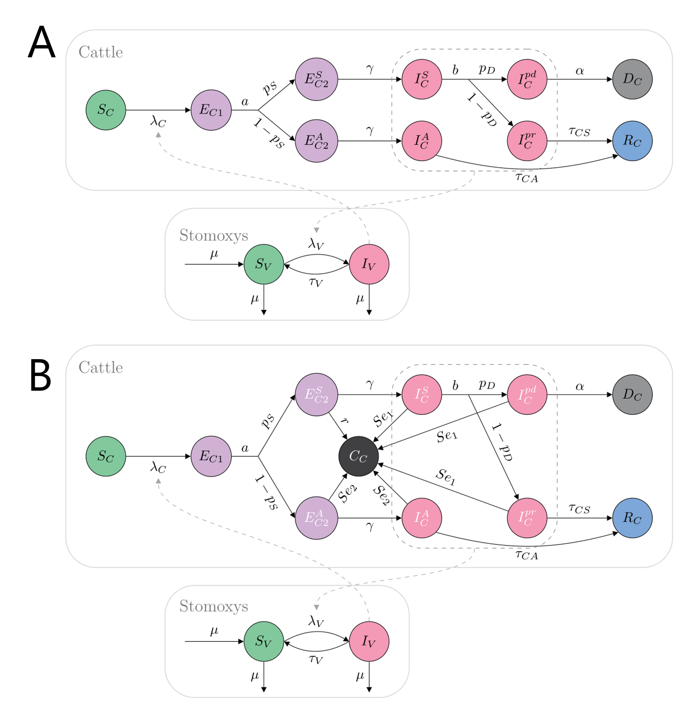

# An intra-farm stochastic model of Lumpy Skin Disease
*Clara Delecroix, 02/02/2026*

This repository contains a stochastic, intra-farm model implemented using the package SimInf to investigate transmission dynamics of Lumpy Skin Disease. 
The implementation of the model is provided in `./scripts/` and example of outputs (trajectories, simulations) are provided in `./figures/`.

## Model formulation

We used a compartmental Ross-Macdonald model to reproduce the transmission dynamics between cattle and vectors (Figure 1A). The model considers a cattle population of 100 cows and a vector population of *Stomoxys calcitrans* with 50 flies per cow. 

The cattle population is subdivided into 10 compartments. The cattle population starts as fully susceptible ($S_C$). Upon infection, they begin their two-stage latent period (compartments $E_{C1}$ and $E_{C2}$). After the first stage of the latent period ($E_{C1}$, lasting $\frac{1}{a}$ days), infected cattle either follow a symptomatic route (with probability $p_S$), leading to the eventual expression of clinical signs, or an asymptomatic route (with probability $1-p_S$). Asymptomatic cattle complete their latent period in $E_{C2 Asymptomatic}$  after a duration of $\frac{1}{\gamma}$ days, before becoming infectious ($I_{C Asymptomatic}$) for a duration of $\frac{1}{\tau_{CA}}$  days and later recover ($R_C$). Future symptomatic cattle complete their latent period in $E_{C2 Symptomatic}$ after a duration of $\frac{1}{γ}$ days, before showing symptoms and becoming infectious ($I_{C Symptomatic}$). Symptomatic infected cattle can then either die from the infection (with a probability $p_D$) after a delay of $\frac{1}{α}$ days completed in $I_{C predeath}$, or recover with a probability ($1-p_D$) after a delay $\frac{1}{\tau_{CS}}$  days completed in $I_{C prerecovery}$. Due to the short time frame of the simulations (less than a year), recovered cattle remain immune to new infections in the R_C compartment, and non–disease-related demographic processes as well as animal movements are ignored. 

The vector population is subdivided into 2 compartments: susceptible $S_V$ and infectious $I_V$. Infectious vectors remain capable of mechanically transmitting the virus for a period of $\frac{1}{\tau_V}$  days following exposure, before becoming susceptible again. The population of vectors is considered to be at a stable equilibrium, with equal birth and death rates $\mu$.  
The force of infection exerted on a susceptible cow is given by

$$\lambda_C= \frac{k \cdot p_C \cdot  I_V}{N_C}$$

with $k$ being the biting rate of the vectors, $p_C$ being the probability that a cow becomes infected upon a bite by a contaminated vector, and $N_C$ being the total number of cows.
The force of infection exerted on a susceptible vector is given by 

$$\lambda_V=k (p_{VS}  \frac{I_{C Symp}+I_{C PreDeath}+I_{C PreRecovery}}{N_C} +p_{VA} \frac{I_{C Asymp}}{N_C} )$$

with $p_{VS}$ and $p_{VA}$ being the probabilities that a susceptible vector becomes contaminated if it bites a symptomatic infectious cow and an asymptomatic infectious cow, respectively.

## Interventions

Selective culling is assumed to start seven days after the first symptomatic animal appears on the farm ($I_{C Symptomatic}>0$), to account for potential delays in suspicion notification, laboratory confirmation, and the regulatory and logistical organization of the culling. Every second day after the initiation of the selective culling protocol, all animals present are tested, and detected infected individuals are culled (Figure 1B), assuming that diagnostic test results and the culling of positive animals are instantaneous. Diagnostic tests are assumed to be perfect when applied to symptomatic infectious cows, with $P(detection|I_{C Symp})=P(detection|I_{C prerecovery})=P(detection|I_{C predeath})=Se_1=1$. However, because viremia in asymptomatic infectious cows has been reported to be intermittent, diagnostic tests are assumed to yield a positive result with probability $P(detection|I_{C Asymptomatic})=Se_2$ on these cows, with $Se2≤ 1$. Diagnostic tests are further assumed to be able to detect infected cows during the second stage of their latent period, that is, before they become infectious, with a sensitivity $P(detection|E_{C2 Symptomatic})=r$ for the individuals that will become symptomatic and with the same sensitivity than the infectious stage for the individuals that will become infectious asymptomatic ($P(detection|E_{C2 Asymptomatic})=Se_2$).

The different selective culling scenarios were defined based on a combination of (1) the sensitivity of the diagnostic test in asymptomatic infectious cows ($Se_2$) and (2) the timeliness of detectability in pre-infectious cows (parameter a in Figure 1): the test sensitivity in asymptomatic infectious cows was varied from 0 to 1 in increments of 0.1; and assuming that both symptomatic and asymptomatic cows become infectious on average 10 days after infection, the timeliness of detectability in pre-infectious cows was varied from 1 day (infected cows can begin testing positive the day after infection) to 10 days (infected cows can only test positive once they become infectious). As this timeliness corresponds to the duration of the first latent stage, the duration of the second latent stage was calculated as the complement of this timeliness to 10 days.

Finally, upon initiation of selective culling (i.e., seven days after the appearance of the first symptomatic animal), the model assumes that vector control is implemented such that the vector population is reduced instantaneously and maintained at this reduced level until the end of virus circulation in the herd. To account for different levels of effectiveness of insecticide treatment, due to varying degrees of vector resistance or protocol compliance, three levels of reduction in the vector population were considered: 0% (no vector control), 50% (moderately effective vector control), and 80% (effective vector control).

*Figure 1: Compartmental model for LSD within-farm transmission. **A** Model without intervention strategies, used until the first detection of an infectious individual. **B** Model with intervention strategies.*

## Parameter values

| Parameter       | Definition    | Value  |  Reference |
| -------------   |:-------------:| :---:  | -----:     |
| $\frac{1}{\mu}$ | Lifespan of *Stomoxys* | 21 days | Vergne et al. 2021 |
| $\frac{1}{\tau_V}$ | Duration of infectiousness of *Stomoxys* | 5.5 days | Haegeman et al. 2023, Sanz-Bernardo et al. 2021 |
| $p_S$ | Probability of showing clinical signs in cattle | 0.5 | Haegeman et al. 2023 |
| $\frac{1}{\tau_{CS}}$ | Duration of infectiousness of symptomatic cattle, for cows not dying from the infection | 40 days | Haegeman et al. 2023 |
| $\frac{1}{\tau_{CA}}$ | Duration of infectiousness of asymptomatic cattle | 15 days | Haegeman et al. 2023 |
| $\frac{1}{\alpha}$ | Delay between symptom onset and death in cattle | 20 days | Tuppurainen et al. 2020 |
| $\frac{1}{b}$ | Delay before subdivision into pre-death or pre-recovery in cattle | 1 day | Assumed |
| $p_D$ | Probability of death for symptomatic cattle | 0.12 | Pite et al. 2017 |
| $\frac{1}{a}$ | Timeliness of detectability in pre-infectious cattle | 1-10 days | Varying |
| $\delta$ | Duration of latency in cattle | 10 days | |
| $\frac{1}{\gamma}$ | Duration between onset of detectability and onset of infectiousness | $\delta - \frac{1}{a}$ | Varying |
| k | Biting rate of *Stomoxys* | 0.5 | Sanz-Bernardo et al. 2021, Vergne et al. 2021 |
| $p_C$ | Probability of cattle infection from being bitten by a contaminated *Stomoxys* | 0.07 | Gubbins et al. 2019 |
| $p_{VS}$ | Probability of *Stomoxys* contamination from biting symptomatic infectious cattle | 0.46 | Gubbins et al. 2019 |
| $p_{VA}$ | Probability of *Stomoxys* contamination from biting asymptomatic infectious cattle | 0.2 | Haegeman et al. 2023 |
| r | Test sensitivity for cattle in the second stage of their latent period prior to becoming infectious symptomatic | 0.5 | Assumed |
| $Se_1$ | Test sensitivity for infectious symptomatic cattle | 1 | |
| $Se_2$ | Test sentivity for infectious asymptomatic cattle | 0-1 | Varying |

